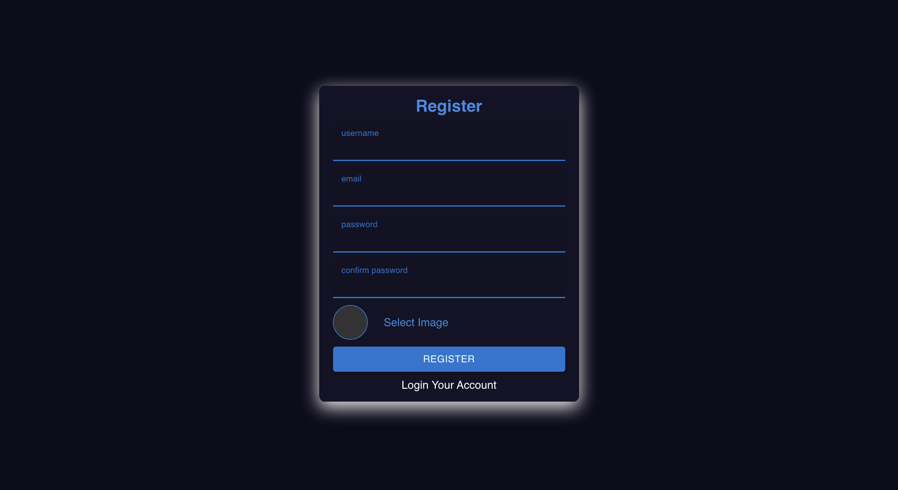
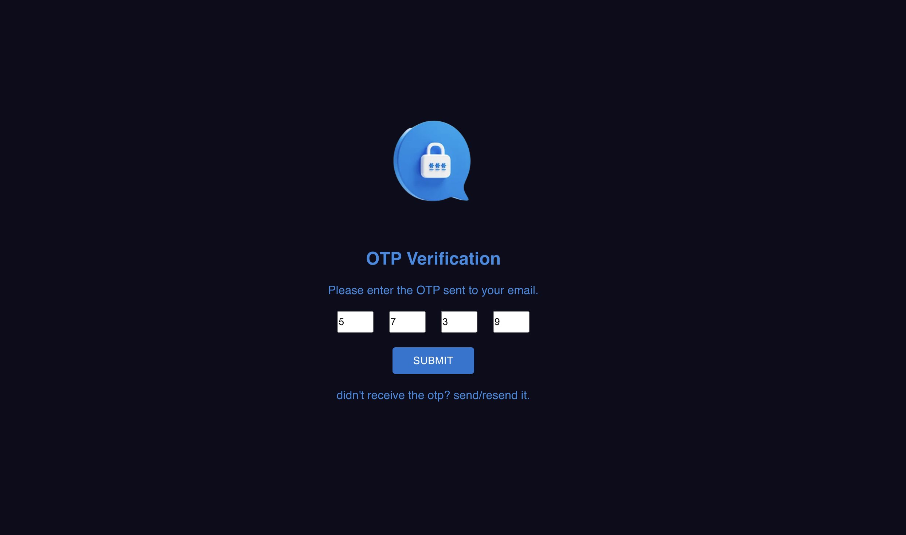
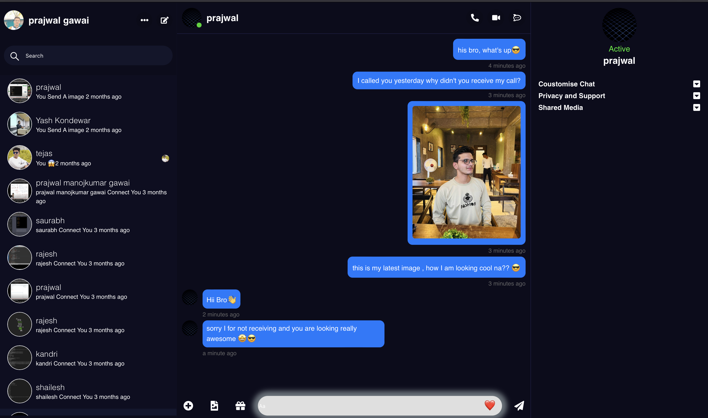

# PChat 💬

This app includes Real Time features like- Message, image sending, receiving, deleting, profile updating, Otp Verification, Secure Login, Registration using Jwt, Dark and Light Theme


## How to use?

Clone the repo and follow the below steps:

For clonning run command
 ```
git clone git@github.com:mahes13/final_messenger.git
 ```

- Install Node.js
- Open the whole Folder in Vs Code or with Any other IDE
- Install Dependencies for frontend, backend and socket folder using the below command for each folder.
- 📌Note that as package.json file of backend present in root directory so run command for backend in root directory of our main folder.

```
npm install
```

- In root directory of our main folder run following command to start frontend and backend.

```
npm run dev
```

- Go to Socket folder and run following command to start sockets.

```
npm run socket
```

- Now your application is running on localhost
- Register and then login via two gmail id's now you can also see your another person in chat application with whom you can start chatting.
- gif and + icon near to sending message are dummy for sending images click on image icon it is functional.


## Pics of the application





## Technologies used:

- React js
- Node js
- Express js
- MongoDb
- Redux
- Socket.io
- Json web token and more
